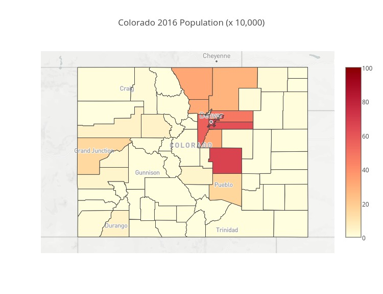

In this tutorial I will demonstrate how to make a county level choropleth with a custom colorbar using Python and Plotly. Much of the material in this tutorial can be found in Plotly's [County Level Choropleth in Python](https://plot.ly/python/county-level-choropleth/) tutorial, with the notable difference being that my tutorial will use a custom colorscale to indicate population of each county. Please see the linked tutorial on downloading Plotly and getting a Mapbox Access Token.

# Getting the Data

I will be using Colorado's population county population data for this tutorial. The population data I will be using has been generously provided by Colorado's state government and can be downloaded from [here](https://data.colorado.gov/Demographics/Colorado-Population-Projections/q5vp-adf3). The website that provides the geojson files with county demarcation data is [CivicDashboards](http://catalog.civicdashboards.com), and the specific colorado county demarcation dataset can be downloaded from [here](http://catalog.civicdashboards.com/dataset/colorado-counties-polygon).

# Let's begin

First begin by importing the python libraries you will need.
<small> note: I am importing os here because I have my Mapbox Access Token saved in my `.bash_profile`, it may not be neccessary for you to do this.</small>

```python
import pandas as pd
import json
import plotly.plotly as py
import plotly.graph_objs as go

import os
```

Next I will read in the data. I am using pandas for data management.

```python
# read in population data
df = pd.read_csv('Population_Colorado.csv')

# read in county border data
with open('colorado_counties.geojson') as f:
    counties = json.load(f)
```

Since the population data is broken out by county, year, and age, I want the sum of the population for each county and year ignoring age. To do this I group the data by county and year and get the sum. I will also drop the columns I don't care about.

```python
full_df = df.groupby(['county', 'year'], as_index=False).sum()
full_df.drop(['fipsCode', 'age', 'malePopulation', 'femalePopulation'],
             inplace = True, axis=1)
```

Now you should have a dataframe `full_df` that looks something like this:

|county   |year   |totalPopulation   |
|:-------:|:-----:|:----------------:|
|Adams    |1990   |265709            |
|Adams    |1991   |273620            |
|Adams    |1992   |281386            |
|...      |...    |...               |

In this tutorial I am only interested in the data for 2015 though so lets isolate the data for that year.

```python
df_2015 = full_df[full_df['year'] == 2015]
```

Now your dataframe `df_2015` should look as such

|county   |year   |totalPopulation   |
|:-------:|:-----:|:----------------:|
|Adams    |2015   |487571            |
|Alamosa  |2015   |16202             |
|Arapahoe |2015   |627056            |
|...      |...    |...               |


Next I want to add a column to my population dataframe that will contain the geographical data. I will begin by checking the name of each county from the geojson file and making sure that it is in the population dataframe and if so, adding it to a dictionary where the key will be the county name and the value will be the geographical data for the county. If a county name from the geojson data is not in the population dataframe it is printed out so that the issue can be reviewed further.

```python
# initialize a dictionary
geo_dict = {}

for x in range(len(counties['features'])):
    # I ignore the last eleven characters in the name since the geojson file includes ' County, CO' in the county names and the population data does not
    name = counties['features'][x]['properties']['name'][:-11]
    if name in df['county'].unique():
        d[name] = counties['features'][x]
    else:
        print 'not in: ', name
```

Once I have my dictionary of geolocation data in order, I want to make it into a pandas series to make it easy to join to my population dataframe

```python
ser = pd.Series(d.values(), index = d.keys())
ser.name = 'coordinates'
```

finally I join the geolocation data to the population dataframe

```python
df_2015 = df_2015.join(ser, on='county')
```

now `df_2015` should look something like this:

|county   |year   |totalPopulation   |coordinates                                      |
|:-------:|:-----:|:----------------:|:-----------------------------------------------:|
|Adams    |2015   |487571            |{u'geometry': {u'type': u'MultiPolygon', u'coo...|
|Alamosa  |2015   |16202             |{u'geometry': {u'type': u'MultiPolygon', u'coo...|
|Arapahoe |2015   |627056            |{u'geometry': {u'type': u'MultiPolygon', u'coo...|
|...      |...    |...               |...                                              |


At this point I need to figure out the colors I will use. I want a pretty diverse scale to really show the differences between the populations for each county. To do this I was able to use [Chroma.js Color Scale](https://gka.github.io/palettes/) to get a hundred seperate color values in the shades that I wanted, so that I could have a seperate shade for each 10,000 people in a county. I needed 101 colors to make it easy to map the colors on a scale from 0 to 1 for Plotly's colorbar feature, so I just repeated the last item of the list twice. I than zip the list into a dictionary

```python
colors = ['#ffffe0','#fffddb','#fffad7','#fff7d1','#fff5cd','#fff2c8',
          '#fff0c4','#ffedbf','#ffebba','#ffe9b7','#ffe5b2','#ffe3af',
          '#ffe0ab','#ffdda7','#ffdba4','#ffd9a0','#ffd69c','#ffd399',
          '#ffd196','#ffcd93','#ffca90','#ffc88d','#ffc58a','#ffc288',
          '#ffbf86','#ffbd83','#ffb981','#ffb67f','#ffb47d','#ffb17b',
          '#ffad79','#ffaa77','#ffa775','#ffa474','#ffa172','#ff9e70',
          '#ff9b6f','#ff986e','#ff956c','#fe916b','#fe8f6a','#fd8b69',
          '#fc8868','#fb8567','#fa8266','#f98065','#f87d64','#f77a63',
          '#f67862','#f57562','#f37261','#f37060','#f16c5f','#f0695e',
          '#ee665d','#ed645c','#ec615b','#ea5e5b','#e85b59','#e75859',
          '#e55658','#e45356','#e35056','#e14d54','#df4a53','#dd4852',
          '#db4551','#d9434f','#d8404e','#d53d4d','#d43b4b','#d2384a',
          '#cf3548','#cd3346','#cc3045','#ca2e43','#c72b42','#c52940',
          '#c2263d','#c0233c','#be213a','#bb1e37','#ba1c35','#b71933',
          '#b41731','#b2152e','#b0122c','#ac1029','#aa0e27','#a70b24',
          '#a40921','#a2071f','#a0051c','#9d0419','#990215','#970212',
          '#94010e','#91000a','#8e0006','#8b0000', '#8b0000']

scl = dict(zip(range(0, 101), colors))
```

Now that I have my color dictionary `scl`, I can map the colors to the population in a new `color` column on my `df_2015` dataframe. I first write a function to do this and than apply it to the dataframe.

```python
def get_scl(obj):
    frac = obj / 10000
    return scl[frac]

full_df['color'] = full_df['totalPopulation'].apply(get_scl)
```

After doing this, `df_2015` should look like this:

|county   |year   |totalPopulation   |coordinates                                      |color   |
|:-------:|:-----:|:----------------:|:-----------------------------------------------:|:------:|
|Adams    |2015   |487571            |{u'geometry': {u'type': u'MultiPolygon', u'coo...|#f67862 |
|Alamosa  |2015   |16202             |{u'geometry': {u'type': u'MultiPolygon', u'coo...|#fffddb |
|Arapahoe |2015   |627056            |{u'geometry': {u'type': u'MultiPolygon', u'coo...|#e35056 |
|...      |...    |...               |...                                              |...     |


At this point we can't start getting data together for the plotly diagram. With county level data in plotly and mapbox, the county geolocations and colors are plotted using a list of dictionary layers inside the layout object. Let's make our layers list.

```python
layers_ls = []
for x in df_2015.index:
    item_dict = dict(sourcetype = 'geojson',
                     source = df_2015.ix[x]['coordinates'],
                     type = 'fill',
                     color = df_2015.ix[x]['color'])
    layers_ls.append(item_dict)
```

so here for each county in the `df_2015` dataframe we add a dictionary that says the source type, the source (our geolocations for each individual county), the type (fill to fill in the color), and the color to fill it with.

let's also go ahead and make a variable with our mapbox access token. Since mine is saved into my `.bash_profile`, I access it as such:

```python
mapbox_access_token = os.environ['MAPBOX_AT']
```

Plotly works largely with dictionaries and plotly subclass dictionaries from the graph_objects class. The documentation for these objects can be found [here](https://plot.ly/python/reference/#scattermapbox-marker-colorbar-len).

Essentially you will make a plotly figure with a data and a layout object. To do county level choropleths with custom map objects, all of your actually plotting will be done in your layout object dictionary. However, to add a colorscale, your colorscale data must be in a data object. I will start by making my data object

Before I do this though I need to have a list for the custom colorscale. The first Item of the list needs to look something like `[0, '#fffddb']` and the item should something like `[[0, '#fffddb']`. It is really important that the first start with 0 and the last item start with 1. If they do not, your colorscale won't show up, and plotly will put a standard own colorscale. I used my colorscale dictionary to make my list as such

```python
colorscl = [[i * .01, v] for i,v in enumerate(scl.values())]
```

it should look something like `[[0, '#fffddb']...[0, '#fffddb']]`

Next I will make a data object. Since you don't actually want your markers to show up, you only need them there to put in a colorscale, just put them at a random latitude and longitude. I did lat:0 lon:0 which is somewhere in central west Africa. Your marker dict is the most important part. `cmax` is how highest value the scale on your colorbar will show, and `cmin` is lowest. `colorscale` is where you put your colorscale list. Make sure `showscale` is `True` and `autocolorscale` is `False`. For `colorbar` use a `go.ColorBar` object where you can adjust the length with `len`. You can also set a title and do other things here. Unfortunately, the title and colorbar layout aren't as customizable as I would have liked so I didn't do much here. See the documentation I linked above.

```python
data = go.Data([
            go.Scattermapbox(
                    lat = [0],
                    lon = [0],
                    marker = go.Marker(
                                  cmax=100,
                                  cmin=0,
                                  colorscale = colorscl,
                                  showscale = True,
                                  autocolorscale=False,
                                  color=range(0,101),
                                  colorbar= go.ColorBar(
                                                 len = .89
                                                        )
                                       ),
                    mode = 'markers')
                     ])
```

Next make your layout object. Play around with the `height`, `width` and `zoom` as well as the `lat` and `lon` in the `center` dictionary of the `mapbox` dictionary to get your plot viewing correctly. I have things set here to view Colorado well.

```python
layout = go.Layout(
    title = 'Colorado 2016 Population (x 10,000)',
    height=1050,
    width=800,
    autosize=True,
    hovermode='closest',
    mapbox=dict(
        layers= layers_ls,
        accesstoken=mapbox_access_token,
        bearing=0,
        center=dict(
            lat=39.03,
            lon=-105.7
        ),
        pitch=0,
        zoom=5.5,
        style='light'
    ),
)
```

finally you can build the figure saving it where you like

```python
fig = dict(data = data, layout=layout)
py.image.save_as(fig, filename='image/test.jpeg',
                 width = 750, height= 575)
```

Now your image should be saved in the location you specified. If you followed with this tutorial exactly, this should be your result:


